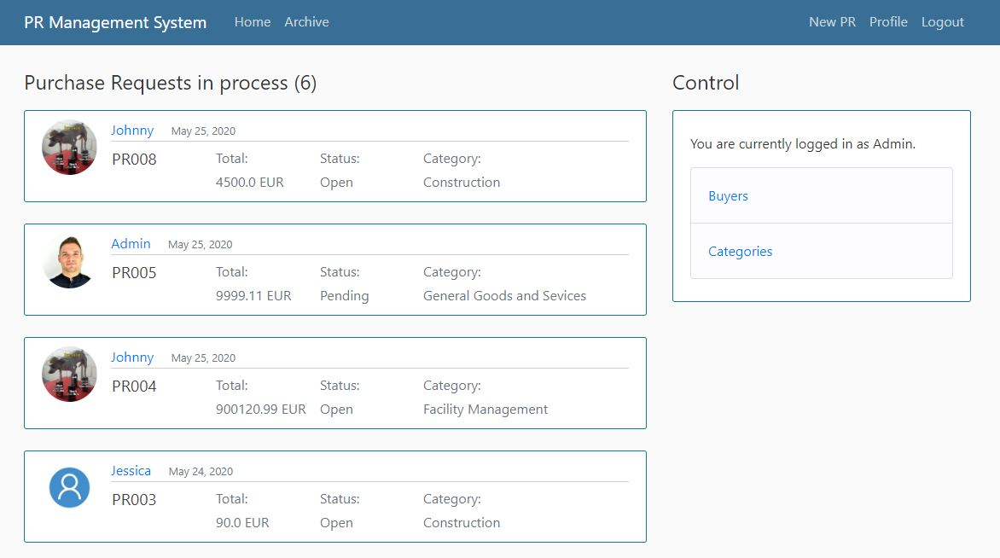
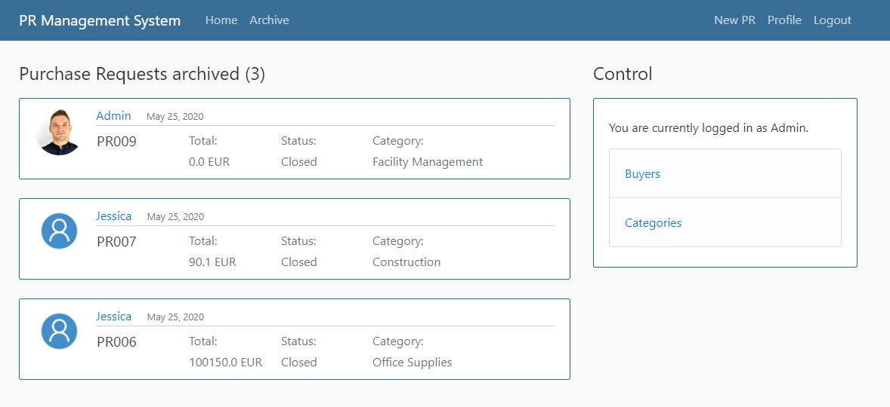

<h2>Django Full Stack Web Application</h2>

<h3>Intro</h3>

The application for requests/tickets/tasks management raised from the need of ecsaping from shared excel files where the risk of getting things messy is very very high. That affects the data quality which has enormous imapct on further reporting and the analysis.

<ul>
 <li>Single django project can have multiple apps (separating blog section and store as both different apps within one web-site)</li>
 <li>Django possess the Object Relational Mapper (ORM) which allows to access database in obejct-oriented way.</li>
 <li>ORM allows to use different databases like SQLite or PostrgreSQL having no changes to code but accessing data with objects, f.e.:
   
  - using SQLite db for development, 
  - using PostgreSQL db for production
 </li>
 <li>In ORM, we can represent database structure with classes - they are called MODELS.</li>
 <li>Once making migration with <b>python manage.py makemigrations</b>, djabgo converts a class into data schema.</li>
</ul>

<h3>Application features:</h3>
<ul>
 <li>Object oriented database.</li>
 <li>Post forms data validation.</li>
 <li>User register/login system.</li>
 <li>User profile panel for info updates.</li>
 <li>Access security system.</li>
 <li>Page content filtering.</li>
  
 
</ul>

<h3>Demo</h3>

First entry site look.

All open requests are stored in the Home tab.

When Purchase Request closed, it goes to the Archive tab.

Each buyer can enter a site with ist own Purchase Requests by clicking on the name.

Each buyer can access its Purchase Requests and udpdate/delete them.

Purchase Request number is restricted to be unique in db.

<h3>Django setup</h3>
<ol>
  <li>Installing django library in venv:
    
   - pip install django
  </li>
  <li>Checking django version:
    
   - python -m django --version
  </li>
  <li>Starting project in project directory:
    
   - django-admin startproject project_name
  </li>
  <li>Running django projects server:
    
   - python manage.py runserver
  </li>
  <li>Creating app:
    
   - python manage.py startapp blog
  </li>
  <li>Data migration each time when we want to update changes to db (first migration will create a database with default tables):
    
   - python manage.py makemigrations 
   - it detects the changes and prepares them to be uploaded to the database
   - the changes are being saved to migrations directory
  </li>
  <li>Applying changes to db:
    
   - python manage.py migrate
  </li>
  <li>Creating superuser:
    
   - python manage.py createsuperuser
  </li>
  <li>Checking sql of migrations:
    
   - python manage.py sqlmigrate app_name num_of_migration 
   - it shows how model class was interpreted into sql statement
  </li> 
</ol>
