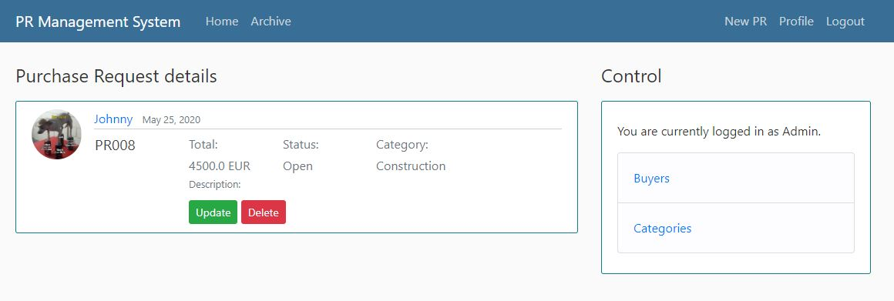

<h2>Django Full Stack Web Application</h2>
<h3>Intro</h3>

The application for requests/tickets/tasks management raised from the need of ecsaping from shared excel files where the risk of getting things messy is very very high. That affects the data quality which has enormous imapct on further reporting and the analysis.

<h3>Demo</h3>

First entry site look.

All open requests are stored in the Home tab.

When Purchase Request closed, it goes to the Archive tab.

Each buyer can enter a site with ist own Purchase Requests by clicking on the name.

Each buyer can access its Purchase Requests and udpdate/delete them.

Purchase Request number is restricted to be unique in db.

